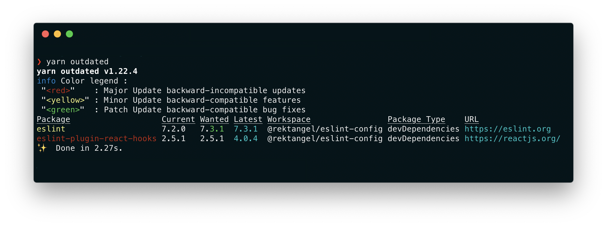

Updating dependencies in an npm project is pretty straight forward and easy to do with the command `yarn upgrade`. It updates all packages to their latest _backwards-compatible_ version. Something that those coming from using `npm update` finds out is that the `yarn` equivalent doesn't update the `package.json` with the new versions. This is usually not a big problem because you have a file called `yarn.lock` in your root directory that keeps track of all your installed versions but if you are a perfectionist like me, you also want the package.json file to reflect what versions used in the project. Before presenting a solution let's explain a bit why it works like this.

As default when you install an npm package with `yarn add` the version of that package in `package.json` is prepended with a caret, like `^7.2.0`. This means that we can upgrade to all upcoming versions of that package as long as it is **not** a _MAJOR_ update. Npm packages are using [Semantic Versioning (semver)](https://semver.org/) so a _MAJOR_ version is a bump that is changing the first number of the version. So in this case version `^7.2.0` can be upgraded to `7.3.1` but not to `8.0.0` for example. If you want to dig deeper into the prepending you can read more [here](https://docs.npmjs.com/misc/semver#versions).



As you see in the above image `eslint` is currently on `7.2.0` and the wanted version is `7.3.1`. On the other hand `eslint-plugin-react-hooks` is multiple versions behind the latest but the wanted version is still the current one. There are no higher versions for `2.X`.

The `yarn.lock` is a huge file that contains the complete dependency tree of all currently installed packages in your project. This means that `yarn.lock` can actually have a version of `7.3.1` of a package while `package.json` has it set to `^7.2.0`. As mentioned above this is all by design and okay because it's not a _MAJOR_ version bump, and they are both equivalent. It's actually what is set in the `yarn.lock` that is the "truth" because the project should be locked to these exact versions.

This is where `yarn upgrade` and `npm update` differ, the first only updates the lock file while the latter updates both the lock file and `package.json`. Because the lock file is the only one that matters it doesn't make any difference in practice. So next time you install this project you will get version `7.3.1` because that is the "locked" one even though it has a lower version in the `package.json`.

There is a simple command to also update the `package.json` when upgrading packages through the terminal with `yarn`. I can run an interactive upgrade tool that is bundled with yarn that gives me the option to pick all versions I want to bump to latest.

```shell
yarn upgrade-interactive --latest
```

This will list all upgradeable versions, and you can select all those you want upgraded with `space`. When done you just press enter and all checked packages will be upgraded and also bumped in `package.json`.


The trick here is that we are using the `--latest` flag which bypasses the default upgrade rule about _MAJOR_ versions. Because this can bump versions way above the standard _backwards-compatibility_ the `package.json` is also updated to reflect that we really make some hardcore updates here 👊🏻

Just be aware bumping a _MAJOR_ version usually has breaking changes so read the CHANGELOG for that specific package before continuing.
