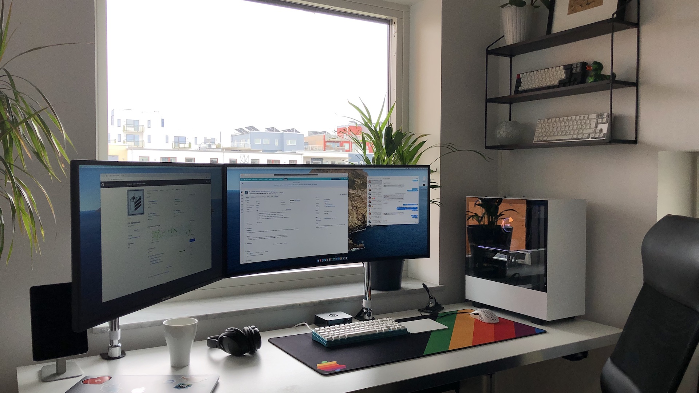

import Seo from '../components/Seo';

<Seo pageTitle="Uses" />

# Uses

I some times get the question what tools and applications I use and because the list is quite long I thought it would be good to write everything down. I try to update this whenever I change or add any new tools.

## Hardware setup

- My main computer is a **hackintosh** dual booting both macOS (daily work) and Windows (gaming) with the following parts:
  - **CPU**: Intel Core i9 9900K
  - **GPU**: Sapphire Radeon RX 5700 XT
  - **Motherboard**: Gigabyte Z390 AORUS PRO WIFI
  - **SSD macOS**: Samsung 970 EVO 500GB
  - **SSD Windows**: Samsung 970 EVO 1TB
  - **RAM**: Corsair 32GB (2x16GB) DDR4 3200MHz
  - **WiFi/BT**: fenvi T919
  - **AIO cooler**: NZXT Kraken X62
  - **Chassi**: NZXT H510i
- Main Display: **LG 34GK950F** - 34" UltraWide IPS 144hz
- Secondary Display: **ViewSonic VA2719** - 27" IPS
- Mouse: **Apple Magic TrackPad 2** & **Zowie EC1-A**
- Keyboard: Some [custom built](/tags/build-log) mechanical keyboard
- Laptop: **MacBook Pro 15" 2018**
- Headphones: **Bose QuietComfort 35 II** for music and **SteelSeries Arctis Pro Wireless** for gaming

## Desktop Applications

- My daily IDE for JavaScript is **[WebStorm](https://www.jetbrains.com/webstorm/)**
- For casual file editing i use **[VSCodium](https://github.com/VSCodium/vscodium)**, like VSCode but without all the trackers
- As a web developer I use many browsers but my main one is **[Brave](https://brave.com/)** and occasionally **[Firefox Developer Edition](https://www.mozilla.org/sv-SE/firefox/developer/)**
- I use **[iTerm2](https://www.iterm2.com/)** as my terminal application
- I manage all my passwords with **[1Password](https://1password.com/)**
- I'm still in search for the perfect Markdown editor but currently I'm using the clean **[MacDown](https://github.com/MacDownApp/macdown)**
- The few times I need to transfer files through SFTP i use **[Transmit](https://panic.com/transmit/)**
- I test my REST and GraphQL APIs with **[Insomnia](https://github.com/Kong/insomnia)**
